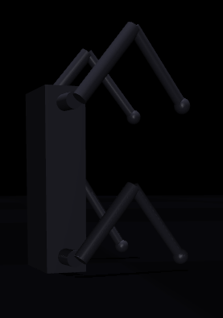
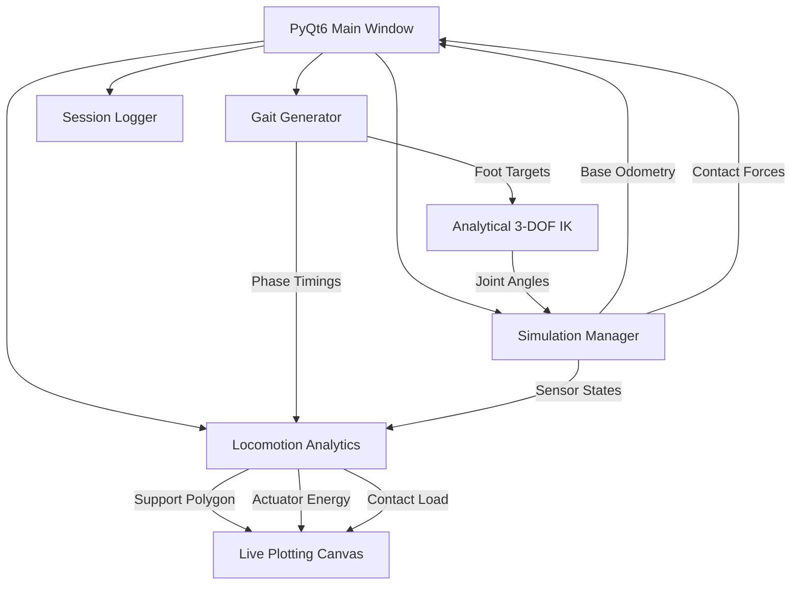

# GaitStudio — Quadruped Locomotion R&D Platform

<p align="center">
  
  
  
  
</p>

GaitStudio is an interactive quadruped locomotion design, synthesis, and analysis environment built for robotics experimentation and real-time control research. Decoupled into a high-frequency physics simulator and a modular diagnostics suite, it provides a powerful sandbox for procedural gait development.

<h3 align="center">Control Dashboard & Physics Simulation Preview</h3>
<p align="center">
  
</p>

<h3 align="center">Procedural Locomotion Demo</h3>
<p align="center">
  <video src="assets/locomotion_demo.mp4" width="800" controls autoplay loop muted></video>
</p>

---

## Key Subsystems



### Core Architecture Highlights
* **Analytical Closed-Form IK Solver**: Triggers microsecond-level leg solves with sub-atomic machine precision, natively handling joint limits and leg extension singularities.
* **Synchronous 240Hz Control Loop**: Executes coordinate phase updates, foot trajectories, analytical IK, physics steps, and rolling estimations at a native **240Hz** to completely eliminate staircase control shocks.
* **Centered Support Polygon Visualizer**: Centered relative to the projected base Center of Mass (COM), ensuring the CCW sorted contact shape remains perfectly aligned and fully visible on screen at any travel distance.
* **27-Channel MuJoCo IMU/Joint Diagnostic Suite**: Injects a comprehensive diagnostics block (imu accelerometer, gyro, quaternions, 12 joint positions, 12 joint torques) to unlock MuJoCo's built-in live rolling charts.
* **Live Gantt Timeline Widget**: Scrolling vector phase indicator representing stance phases as high-impact **neon-green** blocks and swing phases as dark blocks.

---

## Unified & Focus-Free Teleoperation

GaitStudio implements **Focus-Free input forwarding** to make steering intuitive:
* **No-Focus GUI**: Clicking on sliders, buttons, or dropdowns in the PyQt6 window will *never* steal keyboard focus from the main teleoperation listener.
* **MuJoCo Key Forwarding**: Clicking inside the MuJoCo viewer to rotate the 3D camera will *not* break steering. Keypresses are captured by the GLFW viewer and safely forwarded back to the PyQt6 dashboard.
* **Camera Safety**: `W` / `A` / `S` / `D` are left free for MuJoCo's built-in 3D camera, completely preventing rendering blackouts or lost shadows.

### Keyboard Mapping
| Key | Control Target | Action |
| :--- | :--- | :--- |
| **`↑` / `↓`** | **Stride X** | Move forward / backward |
| **`←` / `→`** | **Yaw Steering** | Turn left / right |
| **`PgUp` / `PgDn`** | **Stride Y** | Strafe laterally left / right |
| **`Home` / `End`** | **Body Roll** | Lean torso left / right |
| **`Ins` / `Del`** | **Body Pitch** | Lean torso forward / backward |
| **`Spacebar`** | **E-Brake** | Halts and zeros all locomotion vectors instantly |

---

## Repository Structure

```txt
robot-gait-studio/
├── assets/
│   └── robot.urdf              # Generated quadruped URDF description
├── ik/
│   ├── analytical_ik.py        # Microsecond-level analytical IK solver
│   └── fk_verifier.py          # Forward Kinematics verification sweeps
├── gait_engine/
│   ├── gait_generator.py       # High-frequency parametric phase coordination
│   └── trajectories.py         # 3D Foot trajectory planner (Bézier curves)
├── simulator/
│   └── sim_manager.py          # Simulation Manager (MuJoCo & Standalone 240Hz backends)
├── analytics/
│   ├── stability.py            # Convex hull support polygon & stability margin calculations
│   ├── energy.py               # Actuator mechanical & electrical power estimator
│   ├── slip_detection.py       # Foot slip detector (Jacobian vs world speed)
│   └── gait_metrics.py         # Rolling symmetry, duty factor, and tracking error metrics
├── terrain/
│   └── terrain_generator.py    # Heightmaps (stairs, slopes, rough, stones)
├── recording/
│   ├── recorder.py             # Session logging CSV/JSON writer
│   └── replay.py               # Session replayer playback engine
├── gui/
│   ├── dashboard.py            # Main PyQt6 Control Center (No-Focus, forwarded input)
│   └── widgets.py              # Gantt timeline widget and telemetry cards
├── visualization/
│   └── live_plots.py           # Real-time Matplotlib telemetry subplots
├── main.py                     # Entry point
└── README.md                   # Repository documentation
```

---

## Quick Start

### 1. Install Dependencies
```bash
pip install -r requirements.txt
```
*(On Windows, `pip install mujoco` installs precompiled wheels out-of-the-box. Visual Studio C++ compilers are NOT required!)*

### 2. Verify Kinematics Math
Execute the analytical verification sweeps to confirm trigonometry solver accuracy:
```bash
python -m ik.fk_verifier
```
This utility sweeps 1000 randomized configurations in the joint spaces, matching resolved IK against FK. You should see:
```txt
==================================================
        GAITSTUDIO KINEMATICS VERIFICATION        
==================================================
[+] Left Leg - Default Stance: SUCCESS
    Foot Position: [-0.2194, 0.0600, -0.2356]
    Cartesian Error: 0.00e+00 m
...
Sweep Completed!
Mean Reconstruction Error: 4.75e-17 m
[+] Kinematics engine verified as ROBUST and 100% ACCURATE!
==================================================
```

### 3. Launch the R&D Platform
Run the main control dashboard:
```bash
python main.py
```

---


