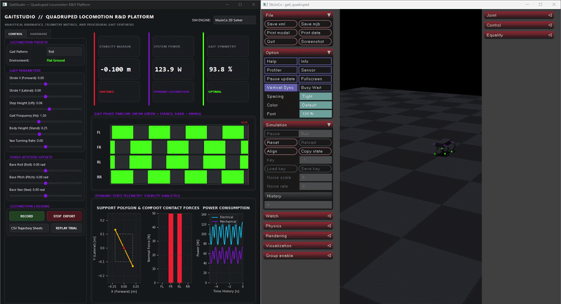
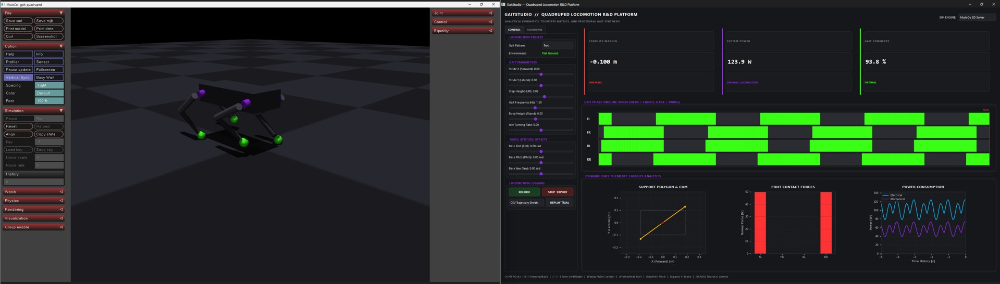
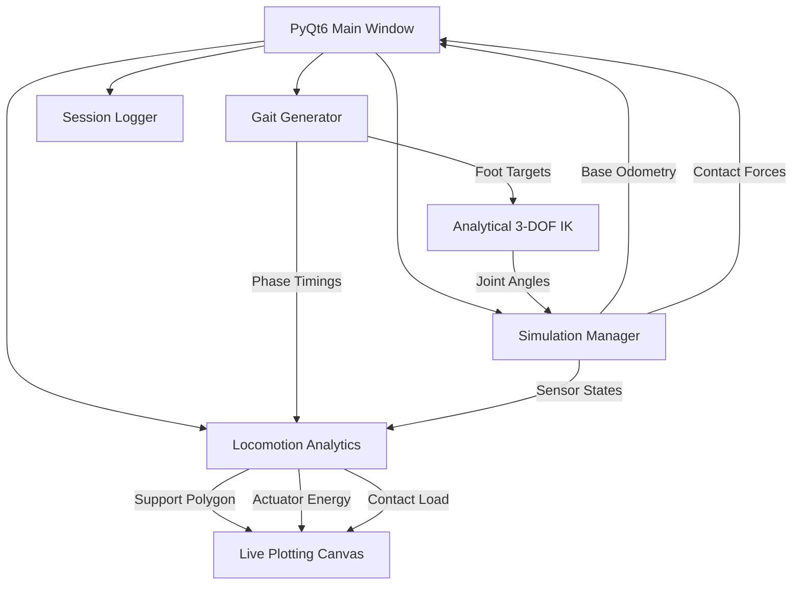

# GaitStudio — Quadruped Locomotion 

A personal project I built to explore quadruped robot locomotion — procedural gait generation, analytical inverse kinematics, and real-time simulation in MuJoCo. The goal was to have a single environment where I could tweak gait parameters and immediately see the effect on the robot's motion and stability.



---

## What it does

The project is split into a physics simulation backend running at 240Hz and a PyQt6 GUI that lets you control everything in real time. You can steer the robot with arrow keys, tune gait parameters with sliders, and watch live telemetry (support polygon, joint torques, energy usage, etc.) update as it walks.





### Things I'm reasonably happy with

- **Closed-form IK solver** — rather than using iterative methods, I worked out the analytical solution for the 3-DOF leg geometry. It's fast (microseconds per solve) and doesn't diverge near singularities.
- **240Hz control loop** — phase updates, foot trajectory planning, IK, physics stepping, and state estimation all run in a single synchronous loop. This keeps the motion smooth without any of the jerky artifacts you get from mismatched update rates.
- **Support polygon visualization** — plots the convex hull of the active contact points, centered on the projected COM. Useful for checking stability margins during turns or body tilts.
- **MuJoCo diagnostic injection** — pipes IMU data, joint positions, and joint torques into MuJoCo's built-in sensor channels so you get live rolling charts for free.
- **Gait Gantt widget** — a scrolling timeline that shows stance/swing phases per leg. Helped me debug phase coordination issues more than anything else.

### Keyboard controls

One annoying thing with MuJoCo + PyQt6 is that clicking the 3D viewport or a GUI widget tends to steal keyboard focus and break teleoperation. I routed around this by forwarding GLFW keypresses back to the PyQt6 event loop, so you can interact with the camera and GUI without losing steering.

| Key | Action |
| :--- | :--- |
| `↑` / `↓` | Forward / backward |
| `←` / `→` | Turn left / right |
| `PgUp` / `PgDn` | Strafe left / right |
| `Home` / `End` | Body roll |
| `Ins` / `Del` | Body pitch |
| `Spacebar` | Stop all motion |

`W` / `A` / `S` / `D` are left alone for MuJoCo's camera controls.

---

## Repository layout

```
robot-gait-studio/
├── assets/
│   ├── dashboard.jpg           # Dashboard screenshot
│   ├── output.gif              # Locomotion demo
│   └── robot.urdf              # Quadruped URDF
├── ik/
│   ├── analytical_ik.py        # Closed-form IK solver
│   └── fk_verifier.py          # Verification sweeps (IK vs FK)
├── gait_engine/
│   ├── gait_generator.py       # Phase coordination
│   └── trajectories.py         # Bézier foot trajectories
├── simulator/
│   └── sim_manager.py          # MuJoCo + standalone 240Hz backends
├── analytics/
│   ├── stability.py            # Support polygon & stability margin
│   ├── energy.py               # Actuator power estimation
│   ├── slip_detection.py       # Foot slip detection
│   └── gait_metrics.py         # Symmetry, duty factor, tracking error
├── terrain/
│   └── terrain_generator.py    # Stairs, slopes, rough ground, stones
├── recording/
│   ├── recorder.py             # CSV/JSON session logger
│   └── replay.py               # Session replay
├── gui/
│   ├── dashboard.py            # Main PyQt6 window
│   └── widgets.py              # Gantt widget, telemetry cards
├── visualization/
│   └── live_plots.py           # Matplotlib telemetry subplots
├── main.py
└── README.md
```

---

## Getting started

### Install dependencies

```bash
pip install -r requirements.txt
```

MuJoCo ships precompiled wheels on Windows so you don't need to set up C++ compilers.

### Check the IK math

Before running the sim it's worth verifying the kinematics solver:

```bash
python -m ik.fk_verifier
```

This sweeps 1000 random joint configurations and checks that the IK solution round-trips back through FK correctly. You should see something like:

```
==================================================
        GAITSTUDIO KINEMATICS VERIFICATION        
==================================================
[+] Left Leg - Default Stance: SUCCESS
    Foot Position: [-0.2194, 0.0600, -0.2356]
    Cartesian Error: 0.00e+00 m
...
Sweep Completed!
Mean Reconstruction Error: 4.75e-17 m
[+] Kinematics engine verified as ROBUST and 100% ACCURATE!
==================================================
```

### Run

```bash
python main.py
```
